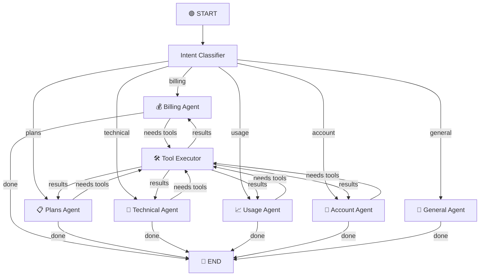

# 📡 TelcoBot — AI-Powered Customer Support Chatbot for TelcoMax

An intelligent, agentic customer support chatbot for **TelcoMax** — a fictitious telecom provider. Built with **LangChain**, **LangGraph**, **Gradio**, **ChromaDB**, and **SQLite**, the application demonstrates a production-grade conversational AI system with multi-agent routing, tool use, memory, and RAG.

---

## 📌 Use Case

Telecom customer support is high-volume and repetitive. Customers frequently ask about:

- **Billing** — "What's my latest bill?", "Why was I charged extra?"
- **Plans** — "What plans do you offer?", "Compare Premium vs Unlimited"
- **Technical issues** — "My data is slow", "I can't make calls"
- **Usage** — "How much data have I used?", "Am I near my limit?"
- **Account management** — "Look up my profile", "Create a support ticket"

**TelcoBot** automates these interactions using an LLM-powered agentic workflow that classifies intent, routes to specialised agents, executes tools against real data, and responds conversationally — all while maintaining multi-turn memory.

---

## 🛠️ Tools & Technologies Used

| Layer | Technology | Purpose |
|-------|-----------|---------|
| **LLM** | OpenAI GPT-4 | Natural language understanding & generation |
| **Orchestration** | LangChain + LangGraph | Agentic workflow, tool binding, state management |
| **RAG** | ChromaDB + OpenAI Embeddings | Knowledge base retrieval for policies & troubleshooting |
| **Database** | SQLite | Persistent customer, billing, usage, and ticket data |
| **UI** | Gradio | Web-based chat interface |
| **Tracing** | LangSmith (optional) | Observability and debugging |
| **Language** | Python 3.10+ | Application language |

---

## 🔌 APIs Integrated

1. **OpenAI Chat Completions API** (`gpt-4`) — intent classification, agent reasoning, response generation
2. **OpenAI Embeddings API** (`text-embedding-3-small`) — document embedding for RAG vector store
3. **LangSmith API** (optional) — trace logging and run visualization

---

## 🔗 LangGraph Workflow Explanation

The workflow is modelled as a **directed graph** with conditional routing:



### Workflow Steps:

1. **Intent Classifier** — A lightweight LLM call classifies the user's message into one of six categories: `billing`, `plans`, `technical`, `usage`, `account`, or `general`.

2. **Conditional Router** — Based on the classified intent, the graph routes to the appropriate specialised agent node.

3. **Specialised Agent** — Each agent has a tailored system prompt and access to only its relevant tools:
   - **Billing Agent** → `get_bill_details`, `get_payment_history`, `get_outstanding_balance`
   - **Plans Agent** → `list_available_plans`, `get_plan_details`, `compare_plans`
   - **Technical Agent** → `search_knowledge_base` (RAG)
   - **Usage Agent** → `get_usage_summary`, `get_daily_usage`
   - **Account Agent** → `get_customer_profile`, `lookup_customer_by_name`, `create_support_ticket`, `get_open_tickets`
   - **General Agent** → No tools; handles greetings and off-topic queries

4. **Tool Executor** — If an agent decides to call a tool, the `ToolNode` executes it and returns the result back to the agent.

5. **Response** — The agent incorporates tool results into a natural-language response and the graph terminates.

---

## 🧠 Memory Implementation

Memory is implemented using **LangGraph's built-in `MemorySaver` checkpointer**:

- Each conversation session is assigned a unique **thread ID** (UUID).
- The `MemorySaver` persists the full message history (user messages, AI responses, tool calls/results) across turns within a session.
- When a new message arrives, the entire conversation history is loaded from the checkpoint and passed to the agent, enabling:
  - **Context continuity** — The agent remembers earlier questions and answers.
  - **Anaphora resolution** — "What about for customer CUST-1002?" refers back to the previously discussed query type.
  - **Progressive refinement** — Multi-step troubleshooting that builds on prior answers.
- The Gradio UI manages session IDs; clicking "Clear Chat" creates a new session with fresh memory.

---

## 📂 Project Structure

```
telecom_support_chatbot/
├── app.py                      # Main application entry point (Gradio UI)
├── requirements.txt            # Python dependencies
├── .env.example                # Environment variable template
├── .gitignore                  # Git ignore rules
├── README.md                   # This file
│
├── config/
│   ├── __init__.py
│   └── settings.py             # Centralised configuration
│
├── agents/
│   ├── __init__.py
│   └── graph.py                # LangGraph workflow definition
│
├── tools/
│   ├── __init__.py
│   ├── billing.py              # Bill inquiry tools
│   ├── plans.py                # Plan information tools
│   ├── usage.py                # Usage tracking tools
│   ├── account.py              # Account management tools
│   ├── tech_support.py         # Technical support (RAG) tool
│   └── rag.py                  # RAG vector store setup
│
├── data/
│   ├── __init__.py
│   ├── database.py             # SQLite schema, seeding, helpers
│   ├── telecom.db              # (auto-generated) SQLite database
│   └── chroma_db/              # (auto-generated) ChromaDB persistence
│
└── knowledge_base/
    ├── troubleshooting.md      # Troubleshooting guides
    ├── policies.md             # Company policies & FAQs
    └── plans_info.md           # Detailed plan descriptions
```

---

## 🚀 How to Run

### Prerequisites

- Python 3.10 or later
- An OpenAI API key

### Installation

```bash
# 1. Clone the repository
git clone https://github.com/your-username/telecom_support_chatbot.git
cd telecom_support_chatbot

# 2. Create a virtual environment (recommended)
python -m venv venv
source venv/bin/activate  # Windows: venv\Scripts\activate

# 3. Install dependencies
pip install -r requirements.txt

# 4. Set up environment variables
cp .env.example .env
# Edit .env and add your OpenAI API key
```

### Running the Application

```bash
python app.py
```

The Gradio interface will launch at `http://localhost:7860`.

### Optional: Enable LangSmith Tracing

```bash
# In your .env file:
LANGCHAIN_TRACING_V2=true
LANGCHAIN_API_KEY=ls-your-langsmith-key
LANGCHAIN_PROJECT=telecom-support-chatbot
```

---

## 💡 Example Prompts

Try these prompts to explore the chatbot's capabilities:

| Category | Example Prompt |
|----------|---------------|
| **Billing** | "What's the latest bill for customer CUST-1001?" |
| **Billing** | "Does CUST-1002 have any outstanding balance?" |
| **Billing** | "Show me the payment history for CUST-1004" |
| **Plans** | "What plans do you offer?" |
| **Plans** | "Compare the Standard and Premium plans" |
| **Plans** | "Tell me about the Family plan" |
| **Technical** | "My data speed is very slow, what should I do?" |
| **Technical** | "How do I set up voicemail?" |
| **Technical** | "Can I use my phone internationally?" |
| **Usage** | "Show me the usage summary for CUST-1001" |
| **Usage** | "What's the daily usage breakdown for CUST-1003?" |
| **Account** | "Look up a customer named Alice" |
| **Account** | "Show me the profile for CUST-1006" |
| **Account** | "Create a support ticket for CUST-1002 about slow internet" |
| **General** | "Hi, what can you help me with?" |

---

## 📸 Screenshots

| Screenshot | Description |
|---|---|
|  | Gradio chat interface on launch |
|  | Billing agent fetching customer bill details |
|  | Plans agent listing available plans |
|  | RAG-powered troubleshooting from knowledge base |
|  | Conversation memory across multiple turns |
|  | Agent remembering prior context |
|  | Usage agent showing data/call/SMS consumption |

---

## 🎬 Demo Video

A short demo video is included at [`demo_video.mp4`](demo_video.mp4). It demonstrates:
- User interaction with the Gradio chat interface
- Tool usage across multiple agent categories
- Multi-turn conversational memory
- End-to-end application behavior

---

## 🧩 Key Features

### Core Features
- ✅ **LangGraph Workflow** — Stateful, directed-graph-based agent orchestration
- ✅ **Conditional Routing** — Intent-based routing to 6 specialised agents
- ✅ **11 Custom Tools** — Database-backed tools for real data retrieval
- ✅ **Multi-turn Memory** — Session-based conversation history via `MemorySaver`
- ✅ **Gradio UI** — Clean web interface with example prompts

### Bonus Features
- ✅ **RAG Integration** — ChromaDB vector store over markdown knowledge base
- ✅ **Database Integration** — SQLite with customers, bills, usage, tickets
- ✅ **LangSmith Tracing** — Optional observability with one env var toggle
- ✅ **Streaming Support** — LLM configured with `streaming=True`
- ✅ **OpenAI Embeddings** — `text-embedding-3-small` for knowledge base indexing

---

## ⚠️ Challenges Faced

1. **Tool Routing Loop** — Early versions caused infinite loops when tool results were re-classified. Solved by routing tool output back to the originating agent using the stored `intent` field.

2. **Memory Scope** — LangGraph's `MemorySaver` stores the complete message list. For very long conversations, this can hit context limits. Mitigated by capping at `MAX_HISTORY_TURNS`.

3. **RAG Chunk Quality** — Initial chunking by fixed character count split mid-sentence. Switching to `RecursiveCharacterTextSplitter` with markdown-aware separators (`## `, `### `) dramatically improved retrieval relevance.

4. **Intent Ambiguity** — Messages like "I was overcharged and I want to switch plans" span multiple intents. The classifier picks the primary intent; multi-intent support is a planned improvement.

5. **Tool Argument Extraction** — The LLM occasionally hallucinates customer IDs. Addressed by adding explicit prompts to ask for the ID if not provided.

---

## 🔮 Future Improvements

1. **Multi-Intent Handling** — Route a single message to multiple agents when it spans categories.
2. **Authenticated Sessions** — Verify customer identity before sharing sensitive data.
3. **Voice Interface** — Add speech-to-text and text-to-speech for phone-style support.
4. **Proactive Alerts** — Notify customers approaching data limits or with overdue bills.
5. **Human-in-the-Loop** — Escalation path to live agents for complex issues.
6. **Deployment** — Containerise with Docker and deploy to cloud (AWS/GCP).
7. **Evaluation Framework** — Automated testing with LangSmith datasets and evaluation metrics.
8. **Multi-language Support** — Support queries in Spanish, French, and other languages.

---

## 📜 License

This project is developed as an educational assignment. Feel free to use and modify for learning purposes.

---

## 🙏 Acknowledgments

- [LangChain](https://langchain.com/) — Framework for LLM application development
- [LangGraph](https://langchain-ai.github.io/langgraph/) — Stateful agent orchestration
- [Gradio](https://gradio.app/) — Rapid UI prototyping for ML applications
- [ChromaDB](https://www.trychroma.com/) — Open-source embedding database
- [OpenAI](https://openai.com/) — GPT-4 and embedding models
