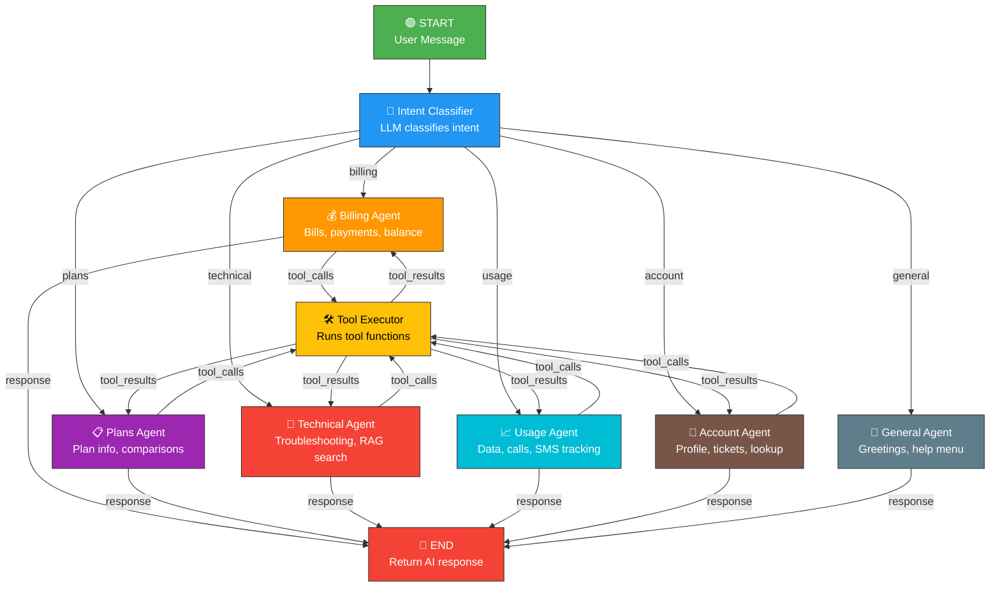
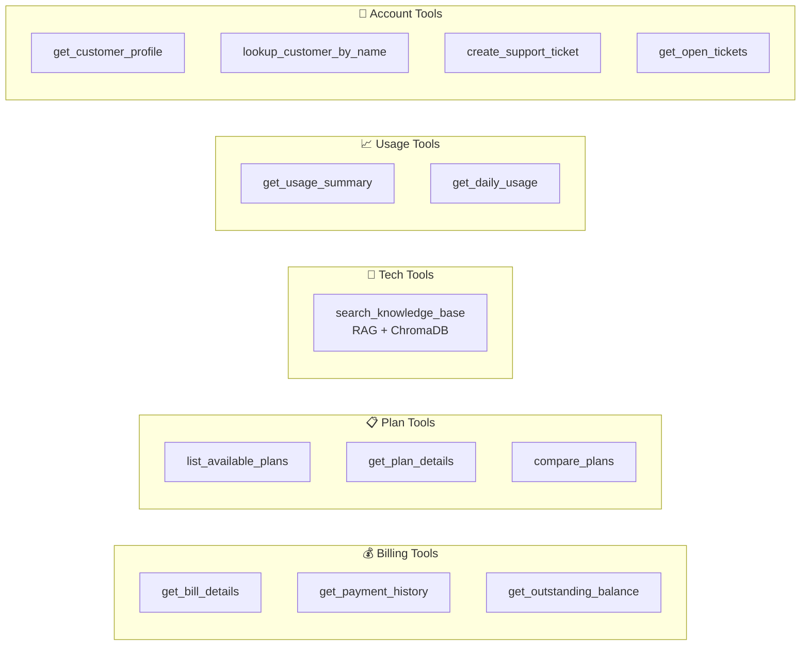
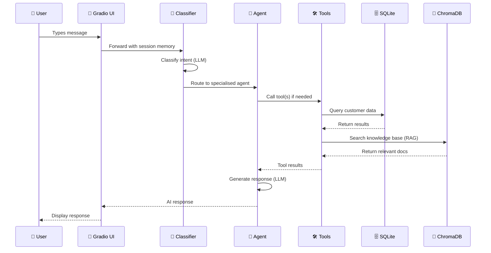
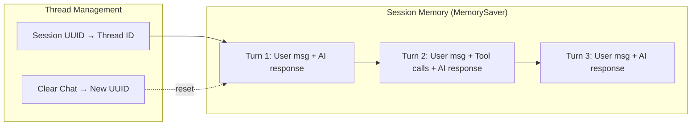

# TelcoBot — LangGraph Workflow Diagram

## Architecture Overview

```mermaid
graph TD
    A[🟢 START<br/>User Message] --> B[🧠 Intent Classifier<br/>LLM classifies intent]

    B -->|billing| C[💰 Billing Agent<br/>Bills, payments, balance]
    B -->|plans| D[📋 Plans Agent<br/>Plan info, comparisons]
    B -->|technical| E[🔧 Technical Agent<br/>Troubleshooting, RAG search]
    B -->|usage| F[📈 Usage Agent<br/>Data, calls, SMS tracking]
    B -->|account| G[👤 Account Agent<br/>Profile, tickets, lookup]
    B -->|general| H[💬 General Agent<br/>Greetings, help menu]

    C -->|tool_calls| I[🛠️ Tool Executor<br/>Runs tool functions]
    D -->|tool_calls| I
    E -->|tool_calls| I
    F -->|tool_calls| I
    G -->|tool_calls| I

    I -->|tool_results| C
    I -->|tool_results| D
    I -->|tool_results| E
    I -->|tool_results| F
    I -->|tool_results| G

    C -->|response| J[🔴 END<br/>Return AI response]
    D -->|response| J
    E -->|response| J
    F -->|response| J
    G -->|response| J
    H -->|response| J

    style A fill:#4CAF50,stroke:#333,color:#fff
    style B fill:#2196F3,stroke:#333,color:#fff
    style C fill:#FF9800,stroke:#333,color:#fff
    style D fill:#9C27B0,stroke:#333,color:#fff
    style E fill:#F44336,stroke:#333,color:#fff
    style F fill:#00BCD4,stroke:#333,color:#fff
    style G fill:#795548,stroke:#333,color:#fff
    style H fill:#607D8B,stroke:#333,color:#fff
    style I fill:#FFC107,stroke:#333,color:#000
    style J fill:#f44336,stroke:#333,color:#fff
```

## Tool Mapping

```mermaid
graph LR
    subgraph "💰 Billing Tools"
        BT1[get_bill_details]
        BT2[get_payment_history]
        BT3[get_outstanding_balance]
    end

    subgraph "📋 Plan Tools"
        PT1[list_available_plans]
        PT2[get_plan_details]
        PT3[compare_plans]
    end

    subgraph "🔧 Tech Tools"
        TT1[search_knowledge_base<br/>RAG + ChromaDB]
    end

    subgraph "📈 Usage Tools"
        UT1[get_usage_summary]
        UT2[get_daily_usage]
    end

    subgraph "👤 Account Tools"
        AT1[get_customer_profile]
        AT2[lookup_customer_by_name]
        AT3[create_support_ticket]
        AT4[get_open_tickets]
    end
```

## Data Flow

```mermaid
sequenceDiagram
    participant U as 👤 User
    participant G as 🎨 Gradio UI
    participant C as 🧠 Classifier
    participant A as 🤖 Agent
    participant T as 🛠️ Tools
    participant DB as 🗄️ SQLite
    participant VS as 💎 ChromaDB

    U->>G: Types message
    G->>C: Forward with session memory
    C->>C: Classify intent (LLM)
    C->>A: Route to specialised agent
    A->>T: Call tool(s) if needed
    T->>DB: Query customer data
    DB-->>T: Return results
    T->>VS: Search knowledge base (RAG)
    VS-->>T: Return relevant docs
    T-->>A: Tool results
    A->>A: Generate response (LLM)
    A-->>G: AI response
    G-->>U: Display response
```

## Memory Architecture

```mermaid
graph LR
    subgraph "Session Memory (MemorySaver)"
        M1[Turn 1: User msg + AI response]
        M2[Turn 2: User msg + Tool calls + AI response]
        M3[Turn 3: User msg + AI response]
        M1 --> M2 --> M3
    end

    subgraph "Thread Management"
        T1[Session UUID → Thread ID]
        T2[Clear Chat → New UUID]
    end

    T1 --> M1
    T2 -.->|reset| M1
```
